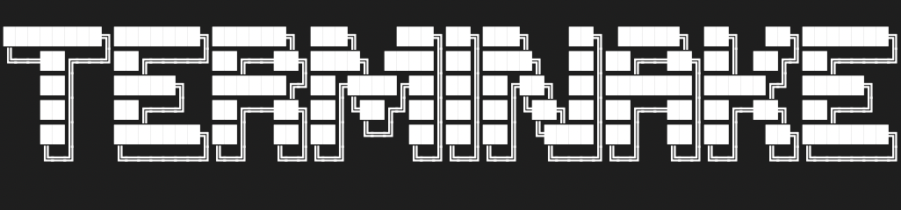

A modern terminal-based Snake game with special effects and power-ups.

## Features

- **Classic Snake gameplay** in your terminal
- **Special food types** with unique effects:
  - 🍌 **Banana** - Grows snake (+2), turns it yellow
  - 🍓 **Strawberry** - Basic food (+1 point)
  - ☕️ **Coffee** - Speed boost (no points)
  - 💣 **Bomb** - Shrinks snake (-1), speed penalty
- **ASCII art score display**
- **Game states**: Menu, Game, Pause, Score
- **Smooth controls** with arrow keys

## Requirements

- Python 3.7+
- Terminal with Unicode support

## Installation

```bash
git clone https://github.com/yourusername/terminake.git
cd terminake
```

## Usage

```bash
python3 src/terminake/main.py
```

## Controls

- **Arrow Keys** - Move snake
- **Q** - Return to menu

## Game Mechanics

Each food type has different spawn rates and effects:
- Strawberries appear most frequently as the default food
- Bananas (40% chance) make your snake yellow
- Coffee (25% chance) provides temporary speed boost
- Bombs (10% chance) are risky but increase overall speed

---

**Built with Python + curses** • **Minimal dependencies**
